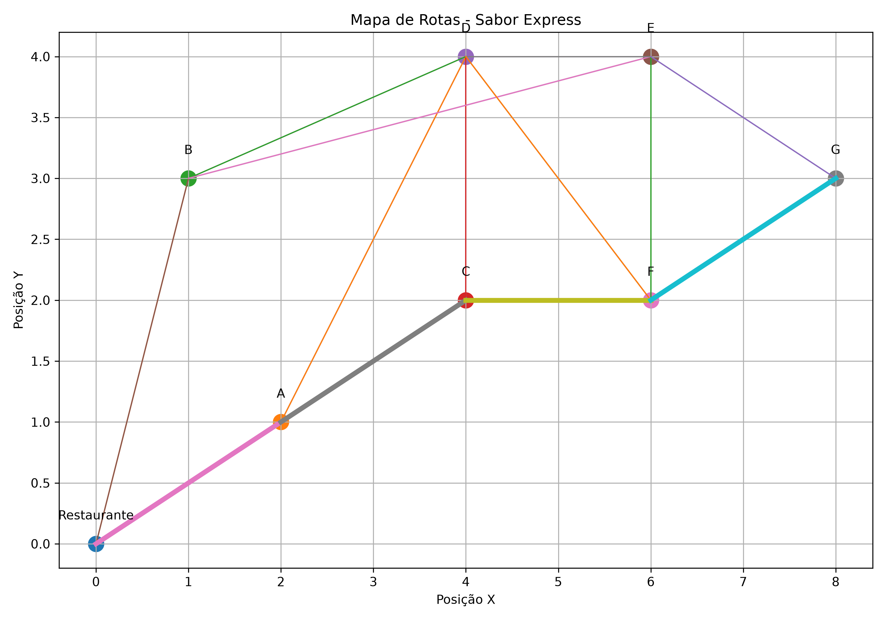
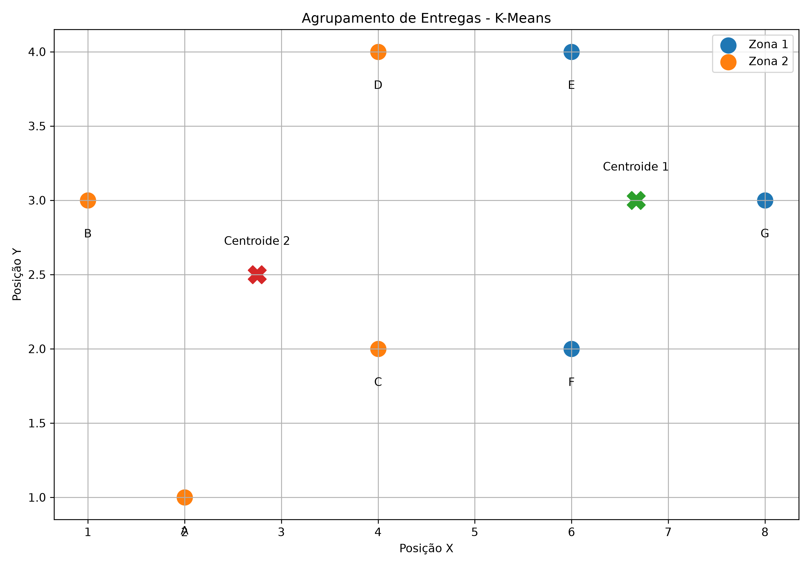

# Rota Inteligente: Otimização de Entregas com Algoritmos de IA

## 1. Descrição do Projeto

O projeto Rota Inteligente foi desenvolvido para a empresa fictícia Sabor Express, uma pequena empresa de delivery de alimentos que enfrenta dificuldades para organizar suas entregas durante períodos de alta demanda.

O objetivo é utilizar algoritmos de Inteligência Artificial para encontrar rotas mais eficientes e organizar os pontos de entrega em regiões próximas.

## 2. Objetivo

O principal objetivo do projeto é desenvolver uma solução computacional capaz de:

- Representar os locais de entrega como um grafo;
- Encontrar caminhos eficientes entre os pontos;
- Agrupar entregas próximas;
- Auxiliar na organização das rotas dos entregadores;
- Reduzir a distância percorrida nas entregas.

## 3. Representação do Problema

A cidade foi representada como um grafo.

Os pontos representam o restaurante e os locais de entrega, enquanto as conexões representam as ruas entre esses locais.

Cada conexão possui um peso relacionado à distância entre os pontos.

Os locais utilizados no projeto são:

- Restaurante
- A
- B
- C
- D
- E
- F
- G

## 4. Algoritmos Utilizados

### A*

O algoritmo A* foi utilizado para encontrar o menor caminho entre dois pontos do grafo.

O algoritmo utiliza o custo do caminho percorrido juntamente com uma função heurística baseada na distância entre o ponto atual e o destino.

### K-Means

O algoritmo K-Means foi utilizado para realizar o agrupamento dos pontos de entrega em duas zonas.

A ideia é identificar grupos de entregas próximas, facilitando a organização dos pedidos.

### Heurística para múltiplas entregas

Para lidar com vários pontos de entrega, foi utilizada uma estratégia que calcula as possíveis rotas com o algoritmo A* e seleciona a próxima entrega com menor distância entre as opções disponíveis.

## 5. Estrutura do Projeto

```text
ROTA-INTELIGENTE/
│
├── data/
│   └── entregas.csv
│
├── docs/
│   ├── mapa_grafo.png
│   └── agrupamento_kmeans.png
│
├── src/
│   └── main.py
│
└── README.md

## 6. Dados

Os pontos de entrega utilizados no projeto estão armazenados no arquivo:

`data/entregas.csv`

O arquivo contém o nome de cada local e suas respectivas coordenadas X e Y.

## 7. Resultados

Após a execução do sistema, foi possível encontrar uma rota para realizar as entregas da Sabor Express.

### Rota encontrada

A rota calculada pelo sistema foi:

**Restaurante → A → C → D → B → E → F → G**

A distância total percorrida foi de **15,00 km**, considerando os pesos definidos para as conexões do grafo.

O sistema visitou **8 locais**, considerando o restaurante como ponto inicial e os sete pontos de entrega.

### Resultado do K-Means

O algoritmo K-Means foi utilizado para agrupar os pontos de entrega em duas zonas, considerando a proximidade entre suas coordenadas.

O agrupamento permite visualizar como os pedidos podem ser organizados em regiões próximas, facilitando o planejamento das entregas.

### Mapa do Grafo



### Agrupamento com K-Means



## 8. Eficiência da Solução

O algoritmo A* utiliza uma função heurística para orientar a busca em direção ao destino, tornando a busca mais eficiente.

O K-Means permite organizar os pontos de entrega em grupos de acordo com a proximidade entre eles.

A combinação dessas técnicas permite criar uma solução computacional para auxiliar na organização e otimização das entregas.

## 9. Limitações

A solução desenvolvida possui algumas limitações:

- O mapa utilizado é uma representação simplificada;
- As distâncias são simuladas;
- Não são considerados dados de trânsito em tempo real;
- A estratégia utilizada para múltiplas entregas é uma heurística e não garante necessariamente a melhor rota global;
- O número de zonas do K-Means é definido previamente.

## 10. Sugestões de Melhorias

Como melhorias futuras, o sistema poderia:

- Utilizar mapas reais;
- Considerar trânsito em tempo real;
- Considerar horários de entrega;
- Utilizar dados reais de distância e tempo;
- Utilizar técnicas mais avançadas de otimização de rotas;
- Permitir diferentes quantidades de entregadores e zonas.

## 11. Tecnologias Utilizadas

- Python
- VS Code
- Algoritmo A*
- K-Means
- Matplotlib
- CSV
- GitHub

## 12. Como Executar

É necessário possuir Python instalado.

Instale a biblioteca utilizada para geração dos gráficos:

```bash
python -m pip install matplotlib